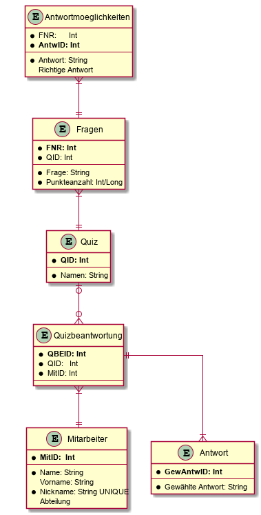

=  Game
// toc-title definition MUST follow document title without blank line!
:toc-title: Table of Contents

//backend: 'docbook'

//keyword: book

***

// numbering from here on
:numbered:

// 1a. Introduction and Goals
include::chapters/Introduction.adoc[]

<<<<
// Abstract
include::chapters/Abstract.adoc[]

<<<<
// 1b. Requirements Overview
include::chapters/Requirements.adoc[]

//Vorstellung
include::chapers/Vorstellung.adoc[]

<<<<
//Aufgabenteilung
include::chapters/DivisionOfTasks.adoc[]

<<<<
// 1c. Qualitygoals
include::chapters/Qualitygoals.adoc[]

<<<<
// 1d. Stakeholders
include::chapters/Stakeholders.adoc[]

<<<<
// 3. System Scope and Context
include::chapters/System_Scope_and_Context.adoc[]

<<<<
// 4. Solution Strategy
include::chapters/Solution_Strategy.adoc[]

<<<<
[[id_designdecisions]]
// 9. Design Decisions
include::chapters/Design_Decisions.adoc[]

<<<<
// ER-Modell

<<<<
//Theorie Eric
include::chapters/Theorie_Eric.adoc[]

<<<<
//Praxis Eric
include::chapters/Praxis_Eric.adoc[]

<<<<
//Theorie Jan
include::chapters/Theorie_Jan.adoc[]

<<<<
//Praxis Jan
include::chapters/Praxis_Jan.adoc[]

