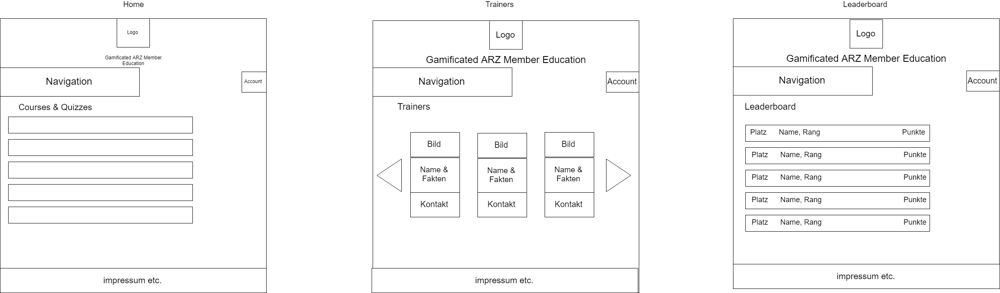
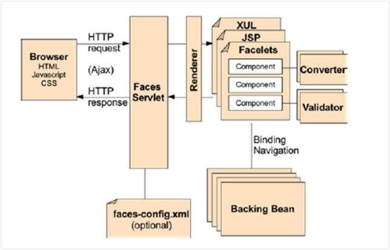
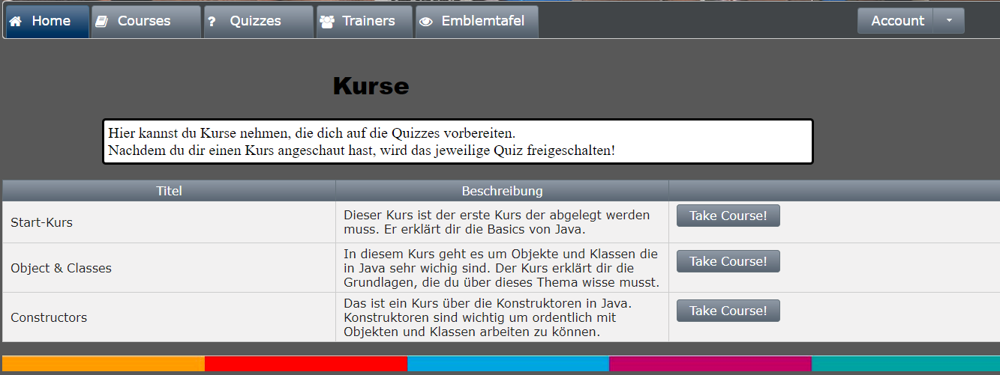
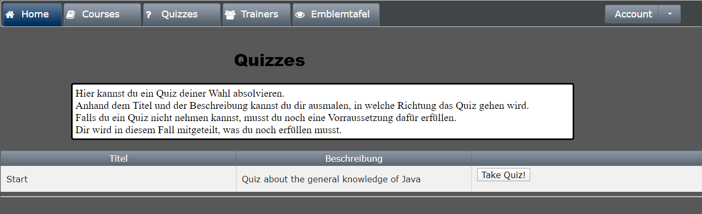
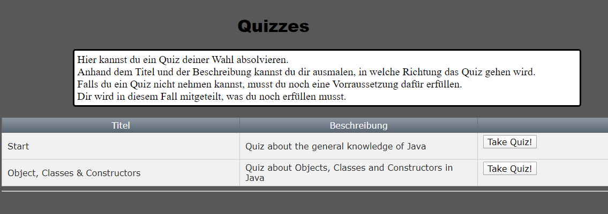
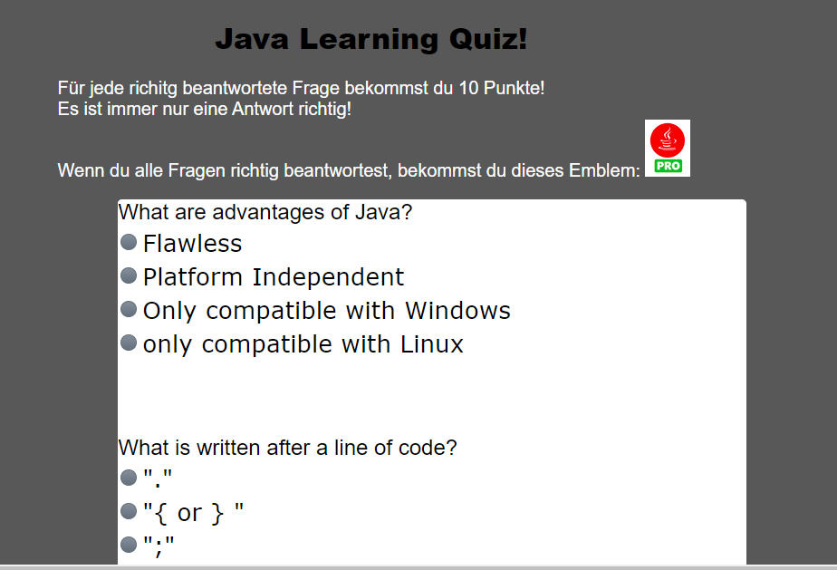
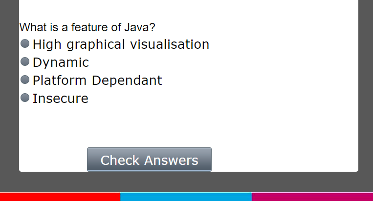
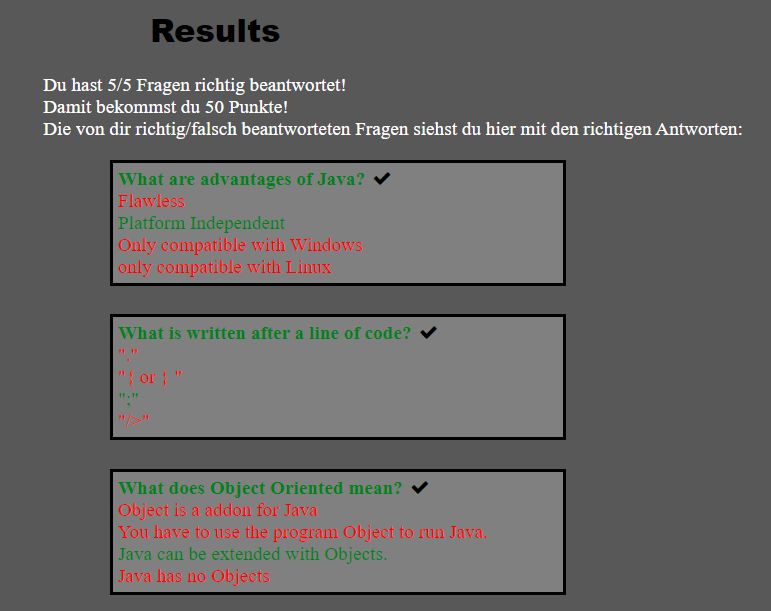
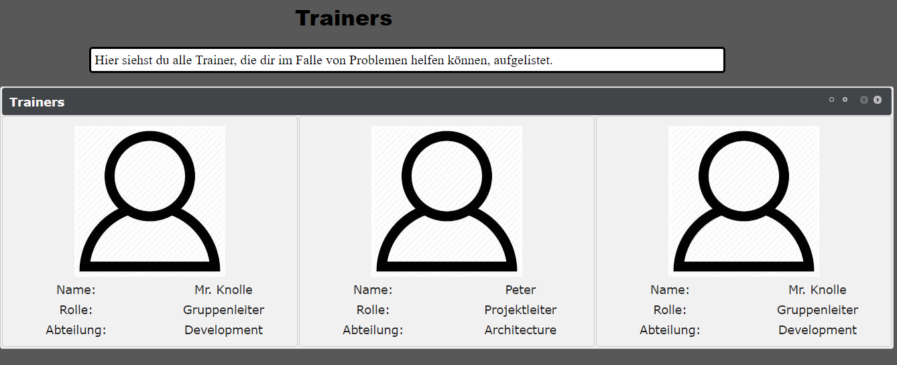
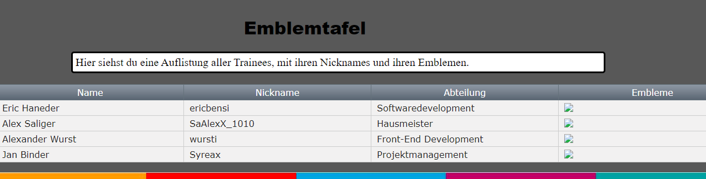

== Praktische Aufgabenstellung: Eric Haneder

== Front End: Design und Graphic User Interface

=== Beginning
To start with designing user interfaces (= front end), a design must be agreed with the client which suits the client an is realizable for us. The front end is the most important part for the user, because it includes everything the user can see and interact with. I discussed this topic with the client and we came to a conclusion

Here is an abstract picture, how the user interfaces should look like:

.User interfaces

After the design was agreed upon, the programming of the interfaces could begin.

=== Fundamentals
Um eine Website zu programmieren, benötigt man ein Menge an umfangreichen Wissen. Man muss html, javascript und css beherrschen. Darüber hinaus sollte man auch wissen, wie aus dem Code eine fertige Seite erzeugt wird, und wie Requests vom User ausgewertet und darauf geantwortet werden kann.
To program a website, you need a lot of extensive knowledge. You have to know HTML, Javascript and CSS. In addition, you should also know how a finished page is generated from the code you programmed and how requests from the user can be evaluated and responded to.

==== JSF
Java Server Faces (JSF) is a programming framwork for the development of graphical user interfaces (GUIs). JSF is a part of the web-technologies of _Java Enterprise Edition_ (Java EE). 
The following graphic shows the architecture of JSF:

.JSF architecture

 * The Browser is there, to display the websites to the user. Through the browser, users can navigate through the interfaces, make requests to the server and get a respone back.
* The Faces Servlet handles user interactions that may lead to changes in the data structure (back en) or on the user interfaces (front end). It can be seen as a controller between the front end and the back end. Every request runs through the Faces Servlet which takes action accordingly. It can optionally be configured by a _faces-config.xml_ file.
* The Renderers are responsible for displaying a component an translating a user's input into the component property values.
* Converters convert a component's value (Integer, Boolean, etc.) to and from markup values (String).
* Validators are responsible for ensuring that the value entered by a user is valid.
* The business logic is made in backing beans, which also control the navigation between pages.
* Facelets describes the language in which JSF files are written (XHTML). Every page has certain components which will be displayed by the browser with the help of renderers.

_(vgl. Goncalves A. (2013). Beginning Java EE 7. Apress.)_

==== HTML
Hypertext Markup Language (HTML) is the common used language for building web pages. A HTML page is a text document (with a .html or .htm extension) used by browsers to present text and graphics. A web page is made of content, tags to change some aspects of the content, and external objects such as images, videos, JavaScript, or CSS files.

.Sample HTML code
[source, html]
----
<html>
    <head>
        <title>My Webpage</title>
    </head>
    <body>
        <h1>This is my webpage</h1>
        

            I hope you like it.
        

        <a href="www.google.at">Link to Google</a>
    </body>
</html>
----
NOTE: U can notice several tags in this code (such as <body> or 
). Every tag has its on purpose, attributes and must be closed. Href is an attribute of the a-tag.

XHTML is just a validated version of html. This means, that there are certain rules, a html-page has to follow, to be valid. XHMTL pages have a .xhtml extension.

Some of the rules are the following:

* All tags must be closed. (so no  , 
, ...)
* All tags are lowercase.
* Attributes appear appear between single or double quotes (<table border="0"> instead of <table border = 0>)
* There must be a strict structure with <html>, <head> and <body> tags.

==== CSS
Cascading Style Sheets (CSS) is a styling language used to describe the presentation of a document written in html or xhtml. CSS is used to define colors, fonts layouts, and other aspects of document presentation.It allows separation of a document’s content (written in XHTML) from its presentation (written in CSS).
To embedd a .css file in your html or xhtml page, use the <link> tag.
(e.g. <link rel="stylesheet" type="text/css" ?

.Sample CSS code
[source,css]
----
p {
    font-size: 10px;
}
h1 {
    color: red;
    font-style: italic;
}
----

=== Getting Started
==== Creating a project structure
To start with a project like this, you need a clean project structure. The project structure has been automatically created with Maven. Our project is "Open Source", that means it is available online for free. That includes our whole project structure and all of the files used to create the website.
The complete GAME project can be viewed under: https://github.com/game-admin/game

==== Creating a layout
To simplify the creation of the UIs, I prepared a layout which serves every page as a template. This layout is realised in "mainlyaout.xhtml". It constructs the picture at the the top of every file with the headline, the menubar and a little picture in the footer.

This page is not displayed directly to the user, but rather represents a template for all user interfaces. Other pages can define this page as a template and then adopt its content. By using <ui:insert> in the template file, you can give the template clients the possibility to define the content of this tag themselves with <ui:define>. This is shown in any of the actual user interfaces.

The menubar is constructed on another file called "menubar.xhtml". It is used to navigate through the platform. Furthermore, the menubar file is very unique, because it is not used directly in every file, but is displayed on every page. This is due to all of the pages using the mainlayout file as a template. It is include in the mainlayout file with the <ui:include> tag:

[source,html]
----
<ui:include src="./faces/menubar.xhtml"></ui:include>
----

The menubar is created by usind the <p:tabMenu> tag of the Primefaces library. It is very convenient to create a menubar with this tag.

.menubar.xhtml
[source,html]
----
include::../game-trainee-web/src/main/webapp/faces/menubar.xhtml[tag=menubar]
----

The "Logout" button on the far left is done with the <p:splitButton> tag. It is placed in the menubar with CSS.

[source, html]
----
include::../game-trainee-web/src/main/webapp/faces/menubar.xhtml[tag=splitButton]
----

I had to separate the menubar from the mainlyout, because of interferences with the formulars.

=== User-Interfaces
Die UIs liegen hier unter src\main\webapp\faces. "ev. noch was zu UIs sagen"

The index-page is the standard page the browser will run, if you enter a website. On this page, the user should get an overwiev about his statistics, and he should be able to navigate to other pages.
The structure of the index-page is pretty simple. All data of the current user is fetched from the database and displayed. The trainee can look at his nickname, score, progress and emblems. Furthermore, a little description of the GAME-site is displayed. From here on, the trainee can check out some courses, take quizzes, look at trainers or visit the emblemboard.

The data is displayed via expression langugage. Here is an example:

[source,html]
----
#{traineeController.getTraineesByID("1").get(0).nickname} 
----

==== Courses-page

The Courses-page should display a list of courses the trainee can go through. These courses can be mandatory to complete Quizzes.

.courses.xhtml
[source,html]
----
include::../game-trainee-web/src/main/webapp/faces/courses.xhtml[tag=dataTable]   
----
The Primefaces tag <p:dataTable> takes a list and knows how to display its content throught the columns. It is the equivalent to the <table> tag of html, but with some extra functions and style modifications. Here, I put in a list of courses. Every course in the list has a titel, description and a link which is displayed in separated columns.

The <p:commanButton> invokes the takeKurs-method when pressed. In this method, a link of the selected course is returned.
The <h:commandLink> is linked to the URL of the course. By clicking on it, the user is redirected to the site of the course.

This is how the courses interface looks like:

==== Quiz pages
The quiz pages include a interface, where every takeable quiz is displayed, two pages for taking a quiz and a page where the results are shown. Every quiz has its own emblem, which can be won if they quiz is taken succesfully. This means the user has to has at least half of the questions right.

.quizzes.xhtml
[source,html]
----
include::../game-trainee-web/src/main/webapp/faces/quizzes.xhtml[tag=dataTable]
----
Here, <p:dataTable> is used again, this time to show all available quizzes. It gets a list of quizzes and displays a quiz whether or not it is takeable. This is evaluated in the isTakeable-method in the QuizController Bean.

This is how it looks like, when the user has not fulfilled the requirements to take a quiz:

In this picture below, the trainee has met all the requirements needed for the second quiz. To take the second quiz, the user must succesfully take the first quiz.

By clicking on the <p:commandButton>, the user can take the quiz.

.takequiz.xhtml
[source,html]
----
include::../game-trainee-web/src/main/webapp/faces/takequiz.xhtml[tag=repeat]
----
This is the page for taking singlechoice-quizzes. The questions are repeatadly displayed by the <ui:repeat> tag. This tag runs through a given list, and displays the wanted data. The answers are displayed with the <p:selectOneRadio>, which renderes a set of buttons based on the data you set with <f:selectItem>.

By clicking on the "Check Answers" button, the trainee is redirected to the results page.

The page for taking multiplechoice quizzes looks almost the same, except for the buttons. I used <p:selectBooleanCheckbox> tags here, because they can be used for multiplechoice purposes. Each of these buttons must be bound to a Boolean property.

"Bilder für takeQuizMultipleChoice"

The results page is responsible for displaying the results of the quiz taken by the trainee. The trainee is able to see how many questions he/she answered right, how many points he/she won and which questions he/she answered incorrectly. Furthermore, the user sees which answers is right for every question. If the question is green and checked, the user answered correctly. If the question is red with a X at the end, the user answered incorrectly.

==== Trainer page
The Trainers page should display all the trainers associated with the GAME platform. The trainees can contact these trainers if they need help.

.trainers.xhtml
[source,html]
----
include::../game-trainee-web/src/main/webapp/faces/trainers.xhtml[tag=trainer]
----
Here I used a primefaces tag called <p:carousel>. This tag is used to create a carousel. The <p:panelGrid> tag is used to display data in a grid. The <p:graphicImage> is just like the JSF tag <h:graphicImage>. <h:outputText> is used to display text, with the function to call a Backing Bean. For easier explanation here is a picture:

 
==== Emblemboard
The emblemboard page is used to diplay all the trainees with their names, nicknames, branches and Icons they got. You should be able to sort them by their names.
 
.leaderboard.xhtml
[source,html]
----
include::../game-trainee-web/src/main/webapp/faces/leaderboard.xhtml[tag=dataTable]
----

Here, the <p:dataTable> tag is used once again. This time it display all the trainees with their emblems for the other trainees to see. Users can compare each other and are able to check out how the other users are doing.

=== Java classes
Java Classes contain business logic that are need for the application. For example, if you want to display data on a page, you have to fetch data. This is done with Java files. To be more specific, Java classes which communicate with pages are called _Backing Beans_.  

Backing Beans are identified by their @Named annotations. Furthermore, every bean has to have a scope annotated. An example for this is the TrainerController class I programmed.

.TrainerController.java
[source,java]
----
@Named
@ViewScoped
public class TrainerController implements Serializable {
     
    private List<Trainer> trainers;
     
    private Trainer selectedTrainer;
     
    @Inject <1>
    private TrainerService service;
     
    @PostConstruct
    public void init() {
        trainers = service.createTrainers(6);
    }
 
    //Getters & Setters
}

----
<1> Here, the TrainerService class is injected via the Jave EE Dependy Injection System. This way, we can use everything from the injected Class, without the need of calling a contructor. The TrainerServe generates a list of trainers to be displayed by the trainers page.

The TrainerController class is used to diplay all the trainers on the trainers.xhtml page. The list of trainees is used in the <p:carousel> tag. 

Another class I developed is the TraineeController. This class is used to display all the trainees on the emblemboard. It looks quite similar to the TrainerController. The only difference is that the data is created by the TraineeEJB class.

The last class I programmed, is the biggest one. It is called QuizController.java and it handles all of the interactions regarding the quizzes. This means it is responsible for forwarding the trainee from the quizzes page to the takquiz page, and from the takequiz page to the results page. Furthermore, it evaluates if a trainee meets all the requirements to take a quiz and it evaluates the results of a taken quiz.

==== Quiz Classes

.QuizController
[source,java]
----
include::../game-trainee-web/src/main/java/org/game/trainee/quiz/QuizController.java[tag=multiple]
----
This method is used to evaluate the results of a MultipleChoice-Quiz. Each button is bound to a boolean-wert of the buttons[]. Every Question is checked, if every button matches the right answers. The user only gets points, if he answers the question correctly.

.QuizController
[source, java]
----
include::../game-trainee-web/src/main/java/org/game/trainee/quiz/QuizController.java[tag=radio]
----
Here, the singlechoice-quizzes get evaluated. This is much easier, because the radiobuttons function differently than the normal buttons. Every set of radiobuttons is bound to one value (selectedAnswer). We only need to check if the selected Answer matches the correct Answer. 

.QuizController
[source, java]
----
include::../game-trainee-web/src/main/java/org/game/trainee/quiz/QuizController.java[tag=checkResults]
----
In _checkResults_, a _Results-List_ i s generated. This list is used to diplay the results on the results.xhtml page.

The QuizController is used to handle everything surrounding the action of taking a quiz. It is responsible for displaying the content on the quizzes-, takequiz- and results-page. It will forward the user from the quizzes page to the takequizpage, where he/she can take the quiz. By clicking on th Submit button, the user is forwarded to the results-site, where their results are shown. 

