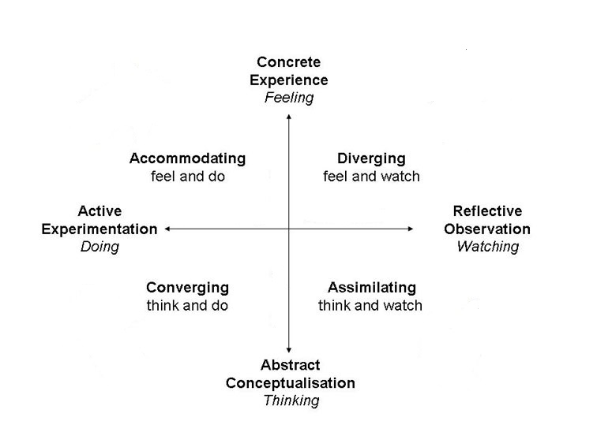

== Theoretische Aufgabenstellung: Eric Haneder

=== Learning

Everyone has to learn, both actively and passively. Whether at school or in professional life, further education is part of the essence of man. The term "learning" usually means the acquisition of knowledge, the development of skills or the practice of motor processes. However, "learning" also refers to activities that are carried out with the aim of changing internal conditions.

_(vgl. Selbstreguliertes Lernen in der dualen Ausbildung - Lerntypen und Bedingungen, Johannes Rosendahl, 2010)_

=== Physiological structures of learning 
Regardless of the theoretical approach to learning, it is true that learning is linked to the ability to modify the central nervous system (CNS) (Birbaumer & Schmidt 1996, 2006). The central nervous system consists of the brain and spinal cord, whose impulse-transmitting cells (neurons) receive and process signals from the peripheral nervous system and generate and transmit signals for the regulation of organs such as muscles. 

Despite the large amount of signals that are constantly received by the sense organs from the environment and transmitted to the CNS, the number of connections between the peripheral nervous system and the CNS is relatively small. Most of the estimated 100 billion neurons (Goldstein 1997, S. 11) serve to process information (pattern recognition, linking), they receive their input from cortical neurons and deliver their output to other cortical neurons.

Learning is based on the plasticity of synapses and dendrites. Plasticity includes activation or breaking of connections between nerve cells, elimination of blocking connections, changes in synaptic density, and branching and thickening of dendrites. Not one but several of these processes are involved in the various forms of learning.

_Dendrites_: root-like branches that make up the impulse-transmitting cells of the CNS
 

_(vgl. Selbstreguliertes Lernen in der dualen Ausbildung - Lerntypen und Bedingungen, Johannes Rosendahl, 2010, S.22)_

There are many people who have tried to classify different learning preferences and learning types. I will discuss these classifications in more detail below.

=== Learning type classification according to Vester

In the book "Denken, Lernen, Vergessen" (Vester, 1998), Frederick Vester defined four types of learning. However, his book was interpreted differently, so that different versions of his classification can be found. At least on the fact that there is an auditory, a visual and a haptic learning type, there is agreement. Though there are some people who think that the fourth learning type after Frederik Vester is the communicative learning type and others think that it is an intellectual learning type.

NOTE: One also comes across terms like "cognitive learning type" ≙ "intellectual learning type", or the "kinesthetic learning type" ≙ "haptic learning type.

.Evidence for a classification according to Vester with a "communicative learning type"
 https://www.teko.ch/die-vier-lerntypen-und-ihre-besonderheiten;
 https://www.mystipendium.de/studium/lerntypen;
 https://karrierebibel.de/lerntypentest/#Die-vier-Lerntypen-angelehnt-an-Frederic-Vester;
 https://learnsolution.de/die-vier-lerntypen-nach-frederic-vester/;
 
.Evidence for a classification to Vester with an "intellectual learning type""
 http://www.rechtschreibwerkstatt-konzept.de/wp-content/uploads/2015/02/Looss_Lerntypen.pdf;
 https://wb-web.de/wissen/lehren-lernen/lernstile-und-lerntypen.html;
 https://smarter-learning.de/lerntypen/klassische-lerntypen-nach-vester/;
 https://wissenschafts-thurm.de/lerntypen/;
 "Erforschung der Lerntypen und -strategien am Beispiel einer Handelsschulklasse", Petra Hochleitner, 2016 
 
I will be analyzing this classification according to Vester:

1. optical/visual -> Learning through seeing and observing
2. auditory/acoustically -> Learning through listening and speaking
3. haptisch -> Learning through action (touching and feeling)
4. cognitive -> Learning through recognition/intellect

==== Auditory learning type
The auditory learning type learns while using his hearing. He/She has no problem listening to someone over long periods of time. The auditive type prefers auditioned learning content and learns better if he/she reads the text aloud himself/herself.

==== Visual learning type
This learning type learns the best, when he takes up the learning content through his eyes. Reading texts will lead to great learning achievements. This gets a better unterstanding of facts through looking at pictures.

==== Haptic learning type
The haptic learning type achieves the best learning succes if he cant feel the information he has to learn.
"Learning by Doing" describes this lerning method pretty good. He prefers to be actively integrated into the learning process. Practical demonstrations are helpful too. 

==== Cognitive/Intellectual learning type
This learning type understands and saves information the best, by thinking about and critically examining the information. The perception channel not important for taking up learning content.

_(vgl."https://smarter-learning.de/lerntypen/klassische-lerntypen-nach-vester/"; letzter Zugriff: 14.01.2020)_

==== Connections
Most of the time, it is not possible to assign someone a certain learning type, as there mix-types of learning. There are some people who learn faster by reading through text and writing it down afterwards (visual & haptic), and others are better of learning by reading and reciting out lout (auditory & haptic).

So if you want to learn effectively, you should try to appeal to more than one sense,  to find a combination that fits your style.

*How are different types of learning formed?*

It would be a lot easier, if everybody could learn the same way. In reality, there a many people with different learning types, this is due to cnahges in personal characteristics, habits and previous experiences.

*So how can you find out which learning type suits you best?*

On the Internet you can find many so-called "learning type tests". In these tests, u have to answer a few simple questions, that depict typical life situations. Here are two hyperlinks, which lead to easy tests:
* http://arbeitsblaetter.stangl-taller.at/TEST/HALB/Test.shtml
* http://www.philognosie.net/index.php/tests/testsview/150/

After completing one of these tests, you will receive a recommendation as to which type of learner is more suitable for you.

NOTE: It should be noted that different tests can also lead to different recommendations. This is due to the fact that the tests have different focuses and are more or less comprehensive. 

If you do not want to take such tests, you can just look up different well-approved learning methods and try them yourself. Check how good you can remember something while using all of the different learning methods either alone or combined.

_(vgl. "Erforschung der Lerntypen und -strategien am Beispiel einer Handelsschulklasse", Petra Hochleitner, 2016)_

=== Learning preferences according to Dunn
Dunn and Price (1989) defined learning style as a typical way of learning that is influenced by different elements of the environment. This regards:

* physical stimuli (light, sound, temperature, design)
* social stimuli (pairs, peers, adults, groups)
* stimuli of learning material (auditiv, visuell, taktil, kinästhetisch)
* emotional stimuli (responsibility, persistence, motivation, disciplin)

These factors are measured by the "Learning Styles Inventory". However, this model takes little account of the actual cognitive processes that play a role in learning.

_(vgl. "Lernorientierungen, Lernstile, Lerntypen und kognitive Stile", Ulrike Creß, in "Handbuch Lernstrategien" von Heinz Mandl & Helmut Felix Friedrich, S.373)_

=== Learning styles according to Pask 
Around 1972, Pask and Scott identified two opposing learning strategies used in problem-solving tasks where people had to search for information independently.They described the consistend usage of these strategies as a learning style.

The holistic strategy means that learners always keep the big picture in mind and only turn to detailed questions in a second step. If this strategy is applied consistently, Pask speaks of the learning style of comprehension learning. On the other hand, learners with a serial strategy work their way step by step through the learning material and primarily turn to individual questions. If this strategy is used consistently, Pask speaks of operation learning. Both strategies can lead to the same success. 

In their extreme form, however, both have a negative effect on performance, which is why Pask assigns both learning styles to corresponding learning pathologies. _Globetrotting_ refers to the learning pathology of extreme comprehension learning, in which learners make inadmissible generalizations without the corresponding individual analysis. _Improvidence_ describes the extreme form of operation learning, in which people lose themselves in details without being able to connect them to a big picture. Since the differences between holistic and serial approaches affect not only learning behaviour but the entire way in which information is sought and processed, they are often interpreted as cognitive styles.

_(vgl."Lernorientierungen, Lernstile, Lerntypen und kognitive Stile", Ulrike Creß, in "Handbuch Lernstrategien" von Heinz Mandl & Helmut Felix Friedrich, S.369)_

=== Learning styles according to Kolb
In 1984 David Kolb took a completely different approach to classifying learning types. According to Kolb, the learning process is based on two orthogonal bipolar dimensions. 

The first dimension depicts how people perceive and collect information. Persons can perceive via the senses through practical experience or through abstract comprehension. 

The second dimension represents the way information is processed. It ranges from active trying to mental observation.
(orthogonal -> two straight lines are called orthogonal if they enclose a 90 degree angle)
The following figure shows the dimensions:

.Learning styles according to Kolb

Quelle (https://selfdirectedlearning.webnode.es/learning-styles-by-kolb/; letzter Zugriff 28.01.2020)

Kolb presents four learning styles defined by the four quadrants that result from these orthogonal dimensions.

_Convergers_ explore their environment through active probing and process information in an abstract way. They are therefore interested in testing their theories and solving problems deductively.

_Divergers_ combine mental observation with practical experience. This often leads them to creative solutions. 

_Assimilators_ connect abstract comprehension with mental observation. They are therefore mainly interested in developing abstract theories and defining problems, less in solving concrete problems.

_Accomodators_ combine active experimentation with concrete experience. They prefer casual learning directly from the situation. The learning style of a person is measured by Kolbs' Learning Style Inventory (KLSI).

Kolb's approach is by far the most frequently cited of the approaches for recording learning styles.

_(vgl. "Lernorientierungen, Lernstile, Lerntypen und kognitive Stile", Ulrike Creß, in "Handbuch Lernstrategien" von Heinz Mandl & Helmut Felix Friedrich, S.371-372)_

=== Selbstreguliertes Lernen

The concept of self-regulated learning is neither a precisely scientifically defined term nor a uniformly used term in everyday language. Furthermore, the terms self-regulated learning, self-directed learning, learner control can hardly be defined clearly.

Niegemann and Hofer (1997) or Büser (2003) define that in self-directed learning, in contrast to self-directed or self-regulated learning, the learning goal is determined by the person himself. Other authors, on the other hand, see the decision on learning goals explicitly as a component of self-directed or self-regulated learning (Arnold & Gomez-Tutor 2006; Dehnbostel 2003; Lang & Pätzold 2006; Neber 1978; Schreiber 1998, S. 45).

_(vgl. Selbstreguliertes Lernen in der dualen Ausbildung - Lerntypen und Bedingungen, Johannes Rosendahl, 2010)_

Beim selbstregulierten Lernen spielt die eigene Motivation eine große Rolle. Hierbei kann die Bildung von Zielintentionen(Lernzielen) helfen. (Die Wahl des Lernziels muss aber nicht zwingend selbstbestimmt erfolgen.)
In diesen Zielintentionen kommen persönliche Standards und Referenzleistungen zum Ausdruck.
In self-regulated learning, the own motivation plays an important role. Here the formation of learning goals can help.
In these learning goals personal standards and reference achievements are expressed.

Based on this goal, actions are taken, their execution is monitored and their results are compared with the goal. In response to the comparison result, the actions are either adjusted or stopped.
The actual self-regulation includes the interacting sub-processes self-observation, evaluation processes and self-reaction (Bandura 1986, S. 337).
During self-observation, the learner registers his performance in terms of various performance dimensions such as quality, originality, quantity and morality as well as correctness and accuracy. Based on this, he will have to take action, as mentioned above. Subsequent results are again observed and evaluated, thus creating a cyclical loop (Bandura 1989).

The term self-regulation emphasizes that a person influences his or her own actions to a considerable extent (Weinert 1982). 
However, this does not exclude the possibility that the trainer/teacher may carry out an occasional learning check (comparison of target and actual learning).
Purely self-regulated action is theoretically possible, such as the creation of an artificial language and its practice through inner speech, but in professional reality there will usually be a greater degree of external control.

=== Gamificated Learning
Gamificated learning is a unique way for learners to remember their learning material. The goal is to maximize enjoyment and egagement through capturing the interest of learners and inspiring them to continue learning (Huang 2013). Gamification in particular means implementing game-elements, to a non-game environment.

Some elements of games that can be used to motivate leaners and ease learning include:

* Progress mechanics (points, badges, leaderboards, etc.)
* Immediate feedback
* Increasing challenges
* Social connection
* Opportunities for mastery, and leveling up

When a learning platform contains the use of some of these elements, it can be considered "gamified". A gamificated system, which is often used in classrooms, is Kahoot. Kahoot is a website, where the teacher can create quizzes, and let the students participate in them via their smartphones. The quiz gets display e.g. with a beamer, so every student can see the questions. The principle is easy: Every student gets to answer the same question in the same timeframe, and whoever answered the fastest, gets the most points. If the student answers incorrectly, he/she will not get any points. At the end of the quiz, a leaderboard is displayed with the best scoring players on the top. This system embraces progress mechanics, immediate feedback and social connection.

=== Conclusion
Learning is an essential part of the human nature. The human race developed they way it did, because humanity kept learning and improving skills. "You never stop learning.", is an important figure of speech. In modern times learning is as important as ever, because the world changes rapidly. 

What we created, was another tool for people to learn new things or check their existing knowledge. We did this in a very unique way. In a _gamificated_ way. Combinding elements of games with learning is proven to improve one's learning capabilitys. Even though, there are severy different learning types, and many more interpretation of such, our system is embracing many of them. For example, the visual learning type reads through the course and remembers the material better that way. The cognitive learning type learns better by taking the quizzes and creating connections in their head.

I tried to include as many of the things I learned by researching my theorethical part of the diploma thesis, into the platform. I think, the members of the ARZ will have an easy learning experience with the website we created.

