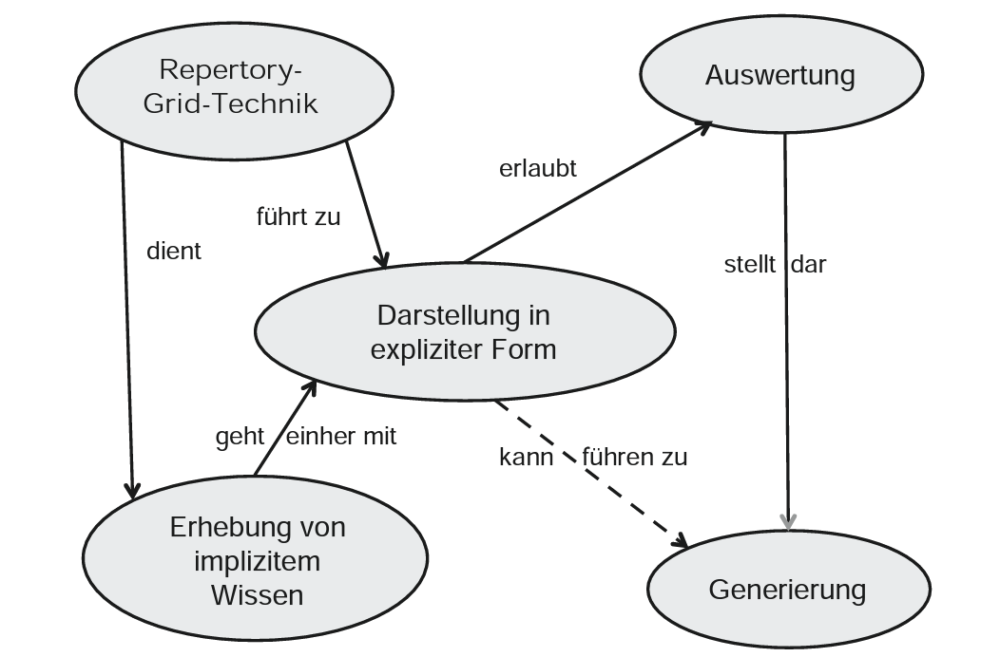

== Theoretische Aufgabenstellung: Jan Binder

== Knowledge management
=== Knowledge

Knowledge is omnipresent whereever we go. Everyone around has more or less knowledge about every kind of topic.

The definition of knowledge is a problem since the early ages. Philosophers like Aristoteles or Platon, who lived ~400 years before christ, worried about what knowledge really is. It is connected to the search of truth. The approach of Platon says that knowledge is acquired by means of deduction, the absolut truth develops through thinking logically. Aristoteles opinion is, that the sensory perception is the only source of insight. The next assumption to this topic wanted to include both approaches and said it is a combination of both. Till now there is only an agreement of the fact, that knowledge is not static and not the absolut truth.

_(vgl. Wissensmanagement in der Schulentwicklung-Theoretische Analyse und empirische Exploratio aus systematischer Sicht - Definitionsproblematik, Kaja Heitmann, 2012)_

=== Knowledge management in context of the knowlegde socitey

=== Knowledge management models

=== Knowledge management methods and tools

==== Repertory-Grid-Technique

This technique is used to acquire knowledge and represent it graphically. People often use mental models to solve problems in their everyday life. These models can be collected and presented transparent with this technique.

===== Origin and Background

_(vgl. Wissensmanagement in der Praxis-Herkunft und Hintergrund, Christian Stary, Monika Moschner, Edith Stary, 2013)_

==== Critical-Incident-Technique (CIT)

The critical-incident technique allows the collection of observed behaviour that led to particular success or failure (this behaviour is therefore referred to as "critical" in the following) in performing a particular activity. Critical incidents are collected by means of questionnaires or interviews either with the performers of the successful or failed task themselves or with observers of the performance of tasks. The method takes particular account of the circumstances that led to the event, i.e. activities and factors that made the event successful or unsuccessful. It thus leads to specific descriptions of behaviour. The collection of critical events of an activity sharpens the awareness of the actions taken. In some cases the interviewees only become aware of the existence of these events during the survey, as they have not yet or only partially dealt with them beforehand.

_(vgl. Wissensmanagement in der Praxis-Critical Incident Technik, Christian Stary, Monika Moschner, Edith Stary, 2013)_

===== Origin

The origin of the critical incident technique goes back to Sir Francis Galton, who conducted studies in this direction as early as the end of the 19th century. Subsequently, controlled observation tests were developed, studies on recreational activities were conducted and anecdotal records were kept. The foundation of the Critical Incident Technique in its present form was not laid until the middle of the Second World War. In the summer of 1941, John Flanagan conducted studies as part of a US Air Force flight psychology program. The purpose of the program was to develop a procedure for selecting and classifying crews. The Critical Incident Technique has since been steadily developed and is now used in a variety of other areas.

===== Objective and possible applications

Critical Incident Technique aims to detect extraordinarily successful or unsuccessful work behaviour caused by critical events. Since the underlying behaviour is analysed, implicit (expert) knowledge is to be recorded and collected. Critical Incident Technique aims to improve work processes and help to avoid experienced errors in the future. Its application should make it easier for employees or those carrying out work activities to perform their tasks more effectively or more easily in the future. The method can also support those responsible in their decision-making in many areas, for example when hiring new employees. Typical issues where the Critical Incident Technique can be helpful are What qualifications should new employees have? How can I increase the motivation and productivity of my employees? How can frequently made mistakes be avoided in the future? On the basis of observed facts, the technology helps to find conclusive answers to such questions and thus to develop options for action. The critical incident technique is particularly suitable for surveys in which a structured, behavioural method is required to raise knowledge or to make explicit knowledge transparent in a structured form and thus accessible to a new group of users. The technique has already been successfully applied in the following areas: 

* Military: The method was introduced by John Flanagan during the Second World War in order to identify and process critical situations in aviation. Concrete events of effective and ineffective behaviour in aviation during the war should be found. To this end, he asked war veterans about events that were particularly important, helpful or inadequate for them to carry out the missions they had been assigned. One question for obtaining these descriptions of behaviour was for example: "Describe the officer's action. What exactly did he do?"

* Police: In this context, the method was used to analyse the activities of police officers in specific work situations. The relationship between stressful circumstances and certain behavioural patterns could be investigated using this technique. Sales: Analogous to the police, work situations were investigated which were characterised by certain customer-product constellations on the one hand and certain behavioural patterns on the other hand.

* (Software) development:  In the context of this assignment, the coordination of tasks between managers and employees was the focus of interest. 

* customer service:  In this assignment, services were analyzed in detail from the consumer's perspective.

* Housework: In this context, the method was used to analyze conflicts that arise when couples with professional careers divide up their housework. 

* Training - concept development:  In this area, the method was used to develop definitions and theories of leadership and professionalism in order to impart knowledge.

Flanagan (1954) himself pointed out a number of other areas of application: 

* Measurement of typical performance criteria:  In this context, the critical incident technique was used to create an observation protocol list that included all the important courses of action for an activity. This list can then be used to objectively evaluate a person's performance.

* Measurement of skills/knowledge (standard samples): Standard samples were used to assess the knowledge of people concerning important aspects of their activities. This form is often used at the end of training courses to assess whether students have retained the knowledge they have acquired or can apply it correctly. 

* Teaching: Many applications of critical incident techniques to problems in training have been developed for specific situations in the military. The technique is intended to help create better conditions for teaching, for example by strengthening motivating didactic moments.

* Job design: For a long time, insufficient attention was paid to job design, although it is essential to promote the motivation of individuals. In this area, the critical-incident technique attempts to limit the number of critical job elements of employees to two or three critical elements. This is intended to maximise the effectiveness of performance in relation to each of the different types of tasks. 

* Operating procedures:  Another application of the method is the study of operating procedures. The method helps to efficiently collect detailed, factual data based on successes or failures that can be systematically analysed. This is an essential prerequisite for improving the effectiveness and performance of operating procedures.

* Equipment design: Here, the design of equipment or fittings is to be improved by collecting critical events in the handling of operating resources and tools. Reports "from the field" form the basis for improvements. Critical-incident technology facilitates the collection and processing of information to improve equipment and tools. 

* Motivation and leadership: Critical incident technology was used in this context to collect data on specific actions, including decisions made and options chosen. From these data, causal relationships between work actions and leadership activities could be derived.

* Psychotherapy: The method is also used in this field. It serves as an aid in the collection of professional-critical events, with particular attention being paid to the interrelation of factors.

The Critical Incident Technique can therefore be used in many economic and social areas due to its openness in terms of content.

_(vgl. Wissensmanagement in der Praxis-Critical Incident Technik-Zielsetzung und Einsatzmöglichkeiten, Christian Stary, Monika Moschner, Edith Stary, 2013)_

==== Balanced Scorecard (BSC)

The BSC is a method for the development and organisation-wide communication of an organisation's mission, vision and strategies derived from them. It can be described as a management system for the strategic management of an organisation with key figures. It is presented by means of a clearly arranged report sheet which contains not only results but also actions with which organisations prepare future activities. Furthermore, the results and actions are considered from different perspectives and in a balanced manner. Different types of BSCs are used in organisational practice. What these approaches have in common is that strategies are translated into concrete actions.

BSCs initially contain the formulation of a central strategic goal (key objective or vision) and the corresponding concretization of the key objective through sub-goals. The sub-goals are derived from several elements: Strategic orientations (topics or factors critical to success). Expectations of various stakeholders (= perspectives) regarding organizational potential. These are: Customers, business processes that primarily have an after-effect, employees (learning and development, innovation), finance and controlling, partners or competitors (suppliers, cooperation partners, associations etc.). The financial management is the focus of attention. The utilization of financial capital is definitely seen as an organization's ultimate goal. Therefore, the financial perspective represents the top level of a hierarchically structured BSC. This perspective is followed by the customer perspective, which describes the value proposition that is made available to the market. Below this is the perspective of the internal business processes, which comprise the value chain of the organization. This chain includes all activities necessary to create the value proposition for customers and transform it into growth and profitability for the shareholder. The foundation of the three perspectives is the learning and development perspective, as it defines intangible assets that are needed to take entrepreneurial activities and customer relationships to a higher level. The other elements of the Balanced Scorecard are: defined metrics as measures for key objectives and selected sub-objectives (strategic themes, perspectives), derived actions that meet the sub-objectives, defined metrics for the actions, organization of joint work for the practical implementation of the strategy (projects, action programs), integration of the metrics into the reporting system.

_(vgl. Wissensmanagement in der Praxis-Balanced Scorecard, Christian Stary, Monika Moschner, Edith Stary, 2013)_
