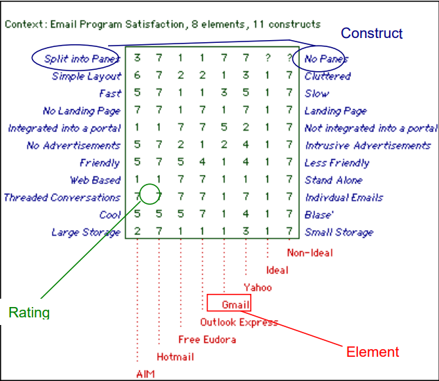

== Theoretical task: Jan Binder (Knowledge management)

=== Knowledge

Knowledge is omnipresent whereever we go. Everyone around has more or less knowledge about every kind of topic.

The definition of knowledge is a problem since the early ages. Philosophers like Aristoteles or Platon, who lived ~400 years before christ, worried about what knowledge really is. It is connected to the search of truth. The approach of Platon says that knowledge is acquired by means of deduction, the absolut truth develops through thinking logically. Aristoteles opinion is, that the sensory perception is the only source of insight. The next assumption to this topic wanted to include both approaches and said it is a combination of both. Till now there is only an agreement of the fact, that knowledge is not static and not the absolut truth.

_(vgl. Wissensmanagement in der Schulentwicklung-Theoretische Analyse und empirische Exploratio aus systematischer Sicht - Definitionsproblematik, Kaja Heitmann, 2012)_

=== Knowledge management in context of the knowlegde socitey

Knowledge management is inseparable from the knowledge society because it is a response to the needs of the knowledge society. This explains why the talk about knowledge management should be preceded by an outline of the knowledge society.  As early as the 1960s and 1970s, scientists described the change to a society in which knowledge becomes increasingly important and is added to the original production factors of an industrial society. In 1966, for example, the American sociologist Robert Lane was the first to speak of a "knowledgeable society" in an article in the American Sociological Review. In his 1969 work "The age of discontinuity", the American economist Peter Ferdinand Drucker outlined social changes within which the resource knowledge plays an important role. The popularization of the concept of a society based on knowledge ultimately goes back to the American sociologist Daniel Bell and his 1973 work "The coming of post-industrial society". However, the theory of the knowledge society should not be confused with its predecessors, such as the theory of the post-industrial society, because it does not share their world view of 'scientific faith'.

<<<<

=== Knowledge management models

=== Knowledge management methods and tools

==== Repertory-Grid-Technique

This technique is used to acquire knowledge and represent it graphically. People often use mental models to solve problems in their everyday life. These models can be collected and presented transparent with this technique.

.Sample Repertory Grid

Quelle (https://www.researchgate.net/figure/Sample-Repertory-Grid_fig1_228296401; letzter Zugriff 15.03.2020)

===== Objective and possible applications

The aim of the method is to collect and present person-related views, implicit knowledge and underlying values on different areas. The RepertoryGrid technique helps to make individual mental models conscious and thus communicable to others, if used correctly and planned accordingly. Thus, the technology can be used in organisations to collect individual views of employees or other stakeholders on certain areas of knowledge and to either transfer this acquired knowledge into technical systems or to pass it on to other people. Possible fields of application of repertory grids today range from marketing to product development, from requirements surveys for technical systems to human resource management. In principle, the method is actually adaptable for all areas of knowledge. In particular, it can also be used to make changes visible, for example, if you want to find out and "measure" how a merger has changed the organizational culture (organizational level), or if you want to show which individual changes in personal knowledge or values have actually been achieved among the participants as a result of a personnel development measure (individual level), or if changes in customer needs are to be surveyed over time (stakeholder level). The method allows those responsible to put themselves in the shoes of those affected, and to do so in a way that is specific to the topic or issue at hand. In addition, a side effect of the use of the method, which can also be the conscious goal of the survey, is that the type of questioning technique can trigger reflection processes related to knowledge. Thus the method can also be used as an intervention method for initiating individual or even organisational changes and learning. When exactly can the method be used? Let us assume, for example, that a clothing chain has difficulties in making its shops attractive to its target audience. Up to now, those responsible for the organisation have assumed that a target-group-oriented placement of products in the shop windows, in our case up-and-coming female managers, is the necessary attractor for high customer frequency. Now that the expected customer frequency has not materialised and customer surveys have not revealed any potential for improvement, repertory grid technology has been used.

===== Realisation

The level of detail and adequacy of the results of the method is strongly dependent on the planning and moderation of the survey process and thus also on the moderation skills of the interviewer. The most important prerequisite for the correct implementation of the method is the observance of the rules of optimal interview management (the basics of this go back to Carl R. Rogers). For the interviewer, this means communicating as genuinely and unadulterated (congruent) as possible and showing appreciation and empathy for the interviewee. Consequently, the interviewer should openly engage with the contents of the interviewee's message and accept the counterpart as an independent personality with his or her own individual mental models. This attitude should enable individual answers that not only confirm the interviewer's mental models but can also contradict or complement them.

Empathy with the other person requires openness and a certain degree of honest curiosity about the other person. Establishing an empathic dialogue relationship promotes the willingness to talk and the actual acquisition of hidden knowledge content. Furthermore, the choice of the right question (no suggestive questions, such as "Don't you agree that grey is more beautiful than black?"), clarification of purpose and procedure prior to the actual interview and the creation of pleasant spatial and temporal conditions are prerequisites for a successful conversation.

If the interviewee is given enough time to think, the repertory grid method can also be used to depict constructs that are otherwise difficult to grasp, such as a feeling of discomfort when entering a business premises. These constructs are feelings and impressions that are usually not easily expressed in a word or a sentence. Here it is recommended to ask step by step (laddering in the sense of "What exactly is it that makes the two shops similar? How can you recognize this? What does this similarity have to do with the subject of the questioning?") until the implicit construct can be described. Only by adhering to these basic attitudes and considerations can a fruitful interview be conducted.

Implicit knowledge is above all context and situation dependent. During the survey, reference should be made above all to situations experienced by the interviewees, which the interviewees experienced as directly as possible before the interview. This makes it easier to remember. In the case of shop attractiveness, for example, a purchase that has taken place should be in the mind's eye of the respondents when they name the characteristics.

In an organisational context, it should not be forgotten that people with work experience or experience in a specific field of activity may not be motivated to share their previously unexplained knowledge with others, as it is precisely this knowledge that sets them apart from other people in an organisation or may even make them indispensable. They may therefore refuse to participate in the implementation of the Repertory Grids or may not be particularly cooperative. Well-prepared information events and intensive individual discussions in advance are therefore particularly important. They can allay fears of losing supremacy and help raise awareness of the potential of the method.

_(vgl. Wissensmanagement in der Praxis-Zielsetzung und Einsatzmöglichkeiten, Christian Stary, Monika Moschner, Edith Stary, 2013)_

==== Critical-Incident-Technique (CIT)

The critical-incident technique allows the collection of observed behaviour that led to particular success or failure (this behaviour is therefore referred to as "critical" in the following) in performing a particular activity. Critical incidents are collected by means of questionnaires or interviews either with the performers of the successful or failed task themselves or with observers of the performance of tasks. The method takes particular account of the circumstances that led to the event, i.e. activities and factors that made the event successful or unsuccessful. It thus leads to specific descriptions of behaviour. The collection of critical events of an activity sharpens the awareness of the actions taken. In some cases the interviewees only become aware of the existence of these events during the survey, as they have not yet or only partially dealt with them beforehand.

_(vgl. Wissensmanagement in der Praxis-Critical Incident Technik, Christian Stary, Monika Moschner, Edith Stary, 2013)_

===== Origin

The origin of the critical incident technique goes back to Sir Francis Galton, who conducted studies in this direction as early as the end of the 19th century. Subsequently, controlled observation tests were developed, studies on recreational activities were conducted and anecdotal records were kept. The foundation of the Critical Incident Technique in its present form was not laid until the middle of the Second World War. In the summer of 1941, John Flanagan conducted studies as part of a US Air Force flight psychology program. The purpose of the program was to develop a procedure for selecting and classifying crews. The Critical Incident Technique has since been steadily developed and is now used in a variety of other areas.

===== Objective and possible applications

Critical Incident Technique aims to detect extraordinarily successful or unsuccessful work behaviour caused by critical events. Since the underlying behaviour is analysed, implicit (expert) knowledge is to be recorded and collected. Critical Incident Technique aims to improve work processes and help to avoid experienced errors in the future. Its application should make it easier for employees or those carrying out work activities to perform their tasks more effectively or more easily in the future. The method can also support those responsible in their decision-making in many areas, for example when hiring new employees. Typical issues where the Critical Incident Technique can be helpful are What qualifications should new employees have? How can I increase the motivation and productivity of my employees? How can frequently made mistakes be avoided in the future? On the basis of observed facts, the technology helps to find conclusive answers to such questions and thus to develop options for action. The critical incident technique is particularly suitable for surveys in which a structured, behavioural method is required to raise knowledge or to make explicit knowledge transparent in a structured form and thus accessible to a new group of users. The technique has already been successfully applied in the following areas: 

* Military: The method was introduced by John Flanagan during the Second World War in order to identify and process critical situations in aviation. Concrete events of effective and ineffective behaviour in aviation during the war should be found. To this end, he asked war veterans about events that were particularly important, helpful or inadequate for them to carry out the missions they had been assigned. One question for obtaining these descriptions of behaviour was for example: "Describe the officer's action. What exactly did he do?"

* Police: In this context, the method was used to analyse the activities of police officers in specific work situations. The relationship between stressful circumstances and certain behavioural patterns could be investigated using this technique. Sales: Analogous to the police, work situations were investigated which were characterised by certain customer-product constellations on the one hand and certain behavioural patterns on the other hand.

* (Software) development:  In the context of this assignment, the coordination of tasks between managers and employees was the focus of interest. 

* customer service:  In this assignment, services were analyzed in detail from the consumer's perspective.

* Housework: In this context, the method was used to analyze conflicts that arise when couples with professional careers divide up their housework. 

* Training - concept development:  In this area, the method was used to develop definitions and theories of leadership and professionalism in order to impart knowledge.

Flanagan (1954) himself pointed out a number of other areas of application: 

* Measurement of typical performance criteria:  In this context, the critical incident technique was used to create an observation protocol list that included all the important courses of action for an activity. This list can then be used to objectively evaluate a person's performance.

* Measurement of skills/knowledge (standard samples): Standard samples were used to assess the knowledge of people concerning important aspects of their activities. This form is often used at the end of training courses to assess whether students have retained the knowledge they have acquired or can apply it correctly. 

* Teaching: Many applications of critical incident techniques to problems in training have been developed for specific situations in the military. The technique is intended to help create better conditions for teaching, for example by strengthening motivating didactic moments.

* Job design: For a long time, insufficient attention was paid to job design, although it is essential to promote the motivation of individuals. In this area, the critical-incident technique attempts to limit the number of critical job elements of employees to two or three critical elements. This is intended to maximise the effectiveness of performance in relation to each of the different types of tasks. 

* Operating procedures:  Another application of the method is the study of operating procedures. The method helps to efficiently collect detailed, factual data based on successes or failures that can be systematically analysed. This is an essential prerequisite for improving the effectiveness and performance of operating procedures.

* Equipment design: Here, the design of equipment or fittings is to be improved by collecting critical events in the handling of operating resources and tools. Reports "from the field" form the basis for improvements. Critical-incident technology facilitates the collection and processing of information to improve equipment and tools. 

* Motivation and leadership: Critical incident technology was used in this context to collect data on specific actions, including decisions made and options chosen. From these data, causal relationships between work actions and leadership activities could be derived.

* Psychotherapy: The method is also used in this field. It serves as an aid in the collection of professional-critical events, with particular attention being paid to the interrelation of factors.

The Critical Incident Technique can therefore be used in many economic and social areas due to its openness in terms of content.

_(vgl. Wissensmanagement in der Praxis-Critical Incident Technik-Zielsetzung und Einsatzmöglichkeiten, Christian Stary, Monika Moschner, Edith Stary, 2013)_

===== Realisation

The use of the critical incident technique proceeds along different phases, as described below. According to Flanagan, however, the definition of a critical event by the critical incident technique can only be considered valid and comprehensive if the observations are representative, if the persons performing the observations are sufficiently qualified, if the types of assessment are appropriate, if the steps used are suitable for generating accurate reports. Decisive for the quality of the surveys and thus the results is how the interview is conducted or how the questions are developed. Thus, one of the most important prerequisites for the correct implementation of the method (as with the methods "Repertory Grid" and "Narrative Storytelling") is the observance of the rules of optimal interview conduct by the interviewers. This requires the interviewer both to openly engage with the content that the interview partners are communicating and to accept the interview partners as the persons they represent. Two aspects are of particular importance for the successful application of the critical incident technique:

1.Questions:: They are the decisive aspect for data collection. Several studies have shown that a small change in the formulation of questions leads to a significant change in the results. For example, the same question was asked in two different ways. Since the respondents perceive or interpret questions differently, different answers can therefore be expected. For this reason, questions should first be asked to a smaller group of respondents before they are finally used. Misunderstandings can be avoided right from the start by determining whether the questions were formulated in a targeted manner and whether relevant answers can be expected. If the interviewers do not receive the desired quality of answers, the questions need to be reworked so that these problems do not occur again when the survey is finally conducted. The interviewers should all understand the same thing about the question. In addition, care should be taken to ensure that the interviewees describe the events or behaviour in a clearly defined situation and do not make (possibly extravagant) statements that deviate from the subject of the survey.

2.Interview conduct:: It is important that the interviewers behave neutrally. As soon as the respondents have given an answer, they should not be confused by inappropriate questions, for example by comments like: "Oh come on, is that really your opinion? Wasn't that completely different?" This could make respondents uncertain about their answers and the results obtained would lose quality and spontaneity. The respondents should be at the floor most of the time during the survey, whereas the interviewers should listen most of the time and only clarify possible problems of understanding of answers or questions. It is advantageous if the respondents are not interrupted. Instead, they should be given the feeling that their opinion as experts is accepted without reservation. If the interviewers get the impression that answers are not complete, they should ask the respondents to refine the respective answer, i.e. to expand on it, but not to correct it. This will motivate the respondents to mention as many details as possible.

==== Balanced Scorecard (BSC)
===== General

The BSC is a method for the development and organisation-wide communication of an organisation's mission, vision and strategies derived from them. It can be described as a management system for the strategic management of an organisation with key figures. It is presented by means of a clearly arranged report sheet which contains not only results but also actions with which organisations prepare future activities. Furthermore, the results and actions are considered from different perspectives and in a balanced manner. Different types of BSCs are used in organisational practice. What these approaches have in common is that strategies are translated into concrete actions.

BSCs initially contain the formulation of a central strategic goal (key objective or vision) and the corresponding concretization of the key objective through sub-goals. The sub-goals are derived from several elements: Strategic orientations (topics or factors critical to success). Expectations of various stakeholders (= perspectives) regarding organizational potential. These are: Customers, business processes that primarily have an after-effect, employees (learning and development, innovation), finance and controlling, partners or competitors (suppliers, cooperation partners, associations etc.). The financial management is the focus of attention. The utilization of financial capital is definitely seen as an organization's ultimate goal. Therefore, the financial perspective represents the top level of a hierarchically structured BSC. This perspective is followed by the customer perspective, which describes the value proposition that is made available to the market. Below this is the perspective of the internal business processes, which comprise the value chain of the organization. This chain includes all activities necessary to create the value proposition for customers and transform it into growth and profitability for the shareholder. The foundation of the three perspectives is the learning and development perspective, as it defines intangible assets that are needed to take entrepreneurial activities and customer relationships to a higher level. The other elements of the Balanced Scorecard are: defined metrics as measures for key objectives and selected sub-objectives (strategic themes, perspectives), derived actions that meet the sub-objectives, defined metrics for the actions, organization of joint work for the practical implementation of the strategy (projects, action programs), integration of the metrics into the reporting system.

_(vgl. Wissensmanagement in der Praxis-Balanced Scorecard, Christian Stary, Monika Moschner, Edith Stary, 2013)_

===== Realisation

Based on experience gained from relevant projects, the following prerequisites apply for the successful implementation of a BSC: 

Teamwork:: A team that works well together and is able to communicate with each other produces higher quality results than individual workers. The team allows for mutual consideration of know-how and favours the motivation of "comrades-in-arms".

Top-down vs. bottom-up approach:: Work on the BSC begins with a joint definition of the organisational mission and vision and the strategic goals that are aligned with them. This can only be determined by top management in cooperation with the following departments. Then the top management level must accompany the process of implementing the BSC throughout the entire organisation, follow it, steer it and make the continuous revision of strategic and also operational goals its own task. However, the employees must be involved in this process, especially since the operational business is to be determined by them in any case (bottom-up design of work processes).

Mission statement (mission) and division of vision:: The management is obliged to state the mission and vision of its organisation in two or three understandable answers to the questions "How and what do we want to be seen as in the public eye?" and "Where do we want to be in five or ten years' time (vision)?" if it wants to make the setting and refinement of objectives transparent. Otherwise, there is a risk of misinterpretation and conflicts of understanding.

Strategy incorporation:: Not only the mission statement and the vision must be communicated to the employees, but also the strategies for the organisation developed from them. They must be known internally in such a way that all employees in the organization understand them as objectives for their daily operative work.

Realistic goal setting::  The basic principle of motivation to participate is that goals are presented in a comprehensible way and can be achieved with great effort. Tactically, it should be possible to achieve such ambitious goals in several stages, via milestones. 

Use of exclusively strategically oriented key figures::  Goal setting alone is not enough - the actual and the target, i.e. the achievement of goals, must be measured. Only then can the person(s) responsible for the achievement of the objectives determine the current situation and inform the employees accordingly. For this reason, the BSC's key figures should only measure what represents the goal, namely the implementation of the strategy. 

Minimum scope:: The "right" key figures should be developed by top management in cooperation with the BSC team. It is not the quantity but the quality of the key figures that is decisive. The latter not only enables concise statements with a high degree of detail, but also facilitates the handling of key figures.

Linking key figures with responsibility:: Conclusions should be drawn from measured target achievement rates. Therefore, for each key figure, what needs to be done to achieve the goal must be determined and responsibilities for this goal achievement must be defined. 

Trust as a control and management instrument:: The proximity of top management should be used to find out whether the right strategies are being measured with suitable key figures. The discussion within the organization should therefore be kept open, both to customers and suppliers and within the employees. In addition, a BSC must also take into account the dynamics of change, whether outside or inside the organization, which have consequences for key performance indicators. This includes the ability of organisations to deal with feedback and to derive learning processes from feedback, as well as the ability to cultivate communication and build trust within the organisation (Friedag, Schmidt 2001). 

Linking the BSC of the organisational levels with the BSC of the organisation as a whole:: Once all employees are aware of the organisational strategy and involved in their activities, they should also be measured by the implementation of the strategies in their area of responsibility. Each area, each department should participate in the strategy and have its own key figures, and thus its own BSC. Practicability and comprehensibility: In this context, the BSC should fit on one page - visual representations of the achievement of objectives are also permitted. 

Change management:: It is essential to deal with key figures that deviate from the plan. The implementation of strategies in the organisation should be the subject of a monthly reflection. This requires an institutionalisation of quality assurance processes, which can be carried out within the framework of certification.

Authenticity:: Since no BSC is like any other, an organisation must also go its own way in the further development of the BSC - it is mostly oriented towards the strengths, but also towards the identified weaknesses of its own organisation.

_(vgl. Wissensmanagement in der Praxis-Balanced Scorecard-Umsetzung, Christian Stary, Monika Moschner, Edith Stary, 2013)_
